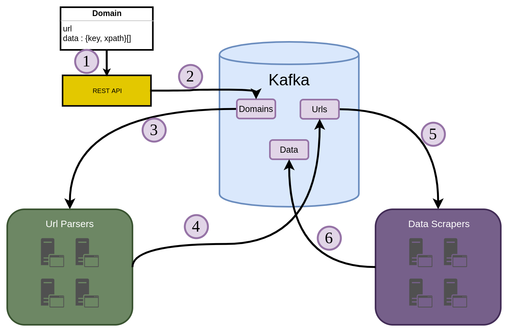

# Namel

> When ants travel, they follow a chemical trail left by other ants

Namel derived from the Arabic word (نمل) means "ants", is a distributed real-time web crawling and analysis framework.

The design of the system is inspired by ants behavior when looking for food, usually ants are not aware of other ants through direct communication, although they follow each other's paths left by pheromones.

Similarly this system doesn't follow the traditional master-slave or peer-peer design principles, it's a queue based design where each node isn't aware of the other.

